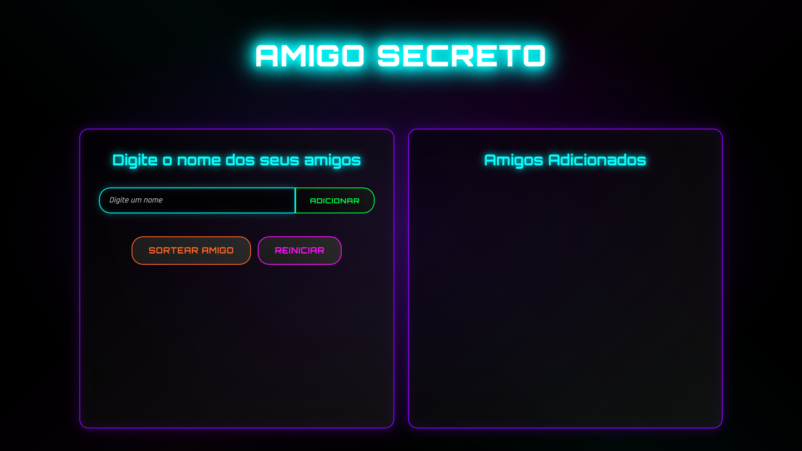
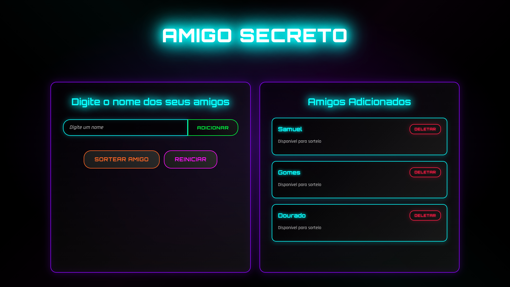

# 🎁 Amigo Secreto - Sorteador

Um aplicativo web moderno e interativo para organizar sorteios de amigo secreto com design futurista e efeitos neon.

## 🌟 Demonstração

### 🖼️ Screenshots

#### Interface Principal


#### Amigos Adicionados


## 🚀 Projeto Hospedado

🔗 **[Ver Projeto Online](https://douradoctrl.github.io/sorteador-alura-challenge/)**

## 📋 Funcionalidades

- ✅ **Adicionar Amigos**: Digite nomes e adicione à lista de participantes
- 🎲 **Sortear Amigo**: Sorteia aleatoriamente um participante da lista
- 🗑️ **Remover Amigos**: Remove participantes individualmente da lista
- 🔄 **Reiniciar Sorteio**: Limpa toda a lista e resultados
- 🎨 **Design Neon**: Interface moderna com efeitos visuais futuristas
- 📱 **Responsivo**: Funciona perfeitamente em desktop e mobile

## 🛠️ Tecnologias Utilizadas

- **HTML5**: Estrutura semântica da aplicação
- **CSS3**: Estilização avançada com:
  - CSS Grid e Flexbox para layout responsivo
  - Animações e efeitos neon
  - Gradientes e sombras personalizadas
  - Variáveis CSS para cores temáticas
- **JavaScript ES6+**: Lógica da aplicação com:
  - Manipulação do DOM
  - Funções de sorteio aleatório
  - Validação de entrada
  - Gerenciamento de estado

## 🎯 Como Usar

1. **Adicionar Participantes**:
   - Digite o nome de um amigo no campo de entrada
   - Clique em "Adicionar" ou pressione Enter
   - O nome aparecerá na lista de participantes

2. **Realizar Sorteio**:
   - Clique no botão "Sortear amigo"
   - Confirme ou rejeite o resultado
   - O participante sorteado será removido automaticamente

3. **Gerenciar Lista**:
   - Remove participantes individualmente com o botão "Deletar"
   - Use "Reiniciar" para limpar toda a lista

## 🎨 Design e Estética

O projeto utiliza uma paleta de cores neon inspirada no tema cyberpunk:

- **Ciano Neon** (`#00ffff`): Elementos principais e títulos
- **Rosa Neon** (`#ff00ff`): Botão de reiniciar
- **Verde Neon** (`#00ff41`): Botão de adicionar e resultados
- **Laranja Neon** (`#ff6600`): Botão de sortear
- **Roxo Neon** (`#8b00ff`): Bordas e contêineres

## 📁 Estrutura do Projeto

```
challenge-amigo-secreto_pt-main/
├── index.html          # Página principal
├── style.css           # Estilos e animações
├── app.js             # Lógica JavaScript
├── README.md          # Documentação
├── LICENSE            # Licença MIT
└── assets/            # Recursos visuais
    ├── amigo-secreto.png
    ├── play_circle_outline.png
    ├── image.png       # Screenshot da interface
    └── image2.png      # Screenshot dos amigos
```

## 🚀 Como Executar Localmente

1. **Clone o repositório**:
   ```bash
   git clone https://github.com/DouradoCtrl/sorteador-alura-challenge.git
   ```

2. **Navegue até o diretório**:
   ```bash
   cd sorteador-alura-challenge
   ```

3. **Abra o arquivo**:
   - Abra `index.html` diretamente no navegador, ou
   - Use um servidor local como Live Server do VS Code

## 🤝 Contribuições

Contribuições são bem-vindas! Sinta-se à vontade para:

- Reportar bugs
- Sugerir melhorias
- Enviar pull requests
- Compartilhar ideias

## 📝 Licença

Este projeto está sob a licença MIT. Veja o arquivo [LICENSE](LICENSE) para mais detalhes.

## 👨‍💻 Autor

**DouradoCtrl**
- GitHub: [@DouradoCtrl](https://github.com/DouradoCtrl)

---

⭐ Se você gostou do projeto, não esqueça de dar uma estrela!
